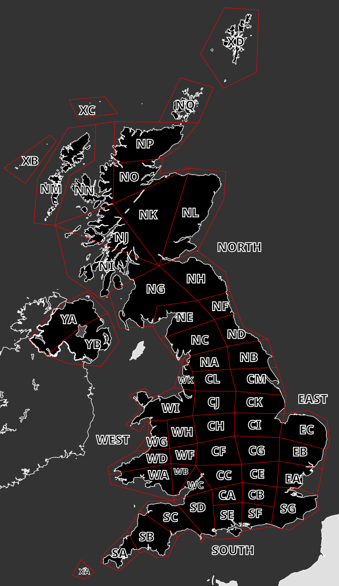

# 4248 UK Weather Research

4248 UK Weather Research (UKWR) is a project to collect and analyse weather data from the UK. The data is collected from meters and other sensors.

## Sections

In this project the UK is divided into sections shown in the map below. 

## Licence

Maps are from Wikimedia Commons and are licensed under the Creative Commons. Please see [Attribution](img/Attribution.md) for more information.

Code is licensed under the GNU General Public License v3.0. And data is licensed under the Creative Commons Attribution 4.0 International License.